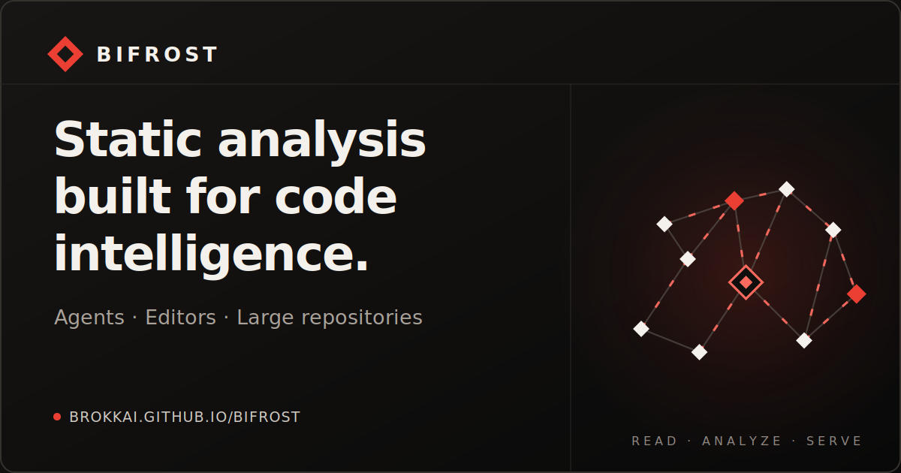

<h1 align="center">Bifrost</h1>

<p align="center">
  <a href="https://brokkai.github.io/bifrost/">
    
  </a>
</p>

<p align="center">
  <a href="https://brokkai.github.io/bifrost/">Documentation</a> ·
  <a href="https://github.com/BrokkAi/bifrost">GitHub</a> ·
  <a href="https://discord.gg/geYkWUeH">Discord</a>
</p>

## Why Bifrost?

`bifrost` is Brokk's Rust-based static analysis toolbox for AI coding harnesses,
editors, and large repositories.

Bifrost gives every supported language a shared intermediate representation, so
the same structural query and navigation workflows work across a mixed-language
repository instead of stopping at language boundaries.

- **One multi-language IR.** Parse unbuilt or partially broken workspaces and
  normalize their source structure for cross-language analysis.
- **A real query language.** Use JSON CodeQuery or the Rune Query Language
  (RQL) to find language-neutral code shapes and traverse indexed declarations,
  references, calls, imports, and type relationships.
- **Built for agents and editors.** Expose structured MCP tools to coding
  agents, LSP features to editors, and the same analyzer through the CLI,
  Python, and Rust.
- **Designed for active repositories.** Snapshot isolation, incremental updates,
  content-based caching, and git/worktree awareness keep analysis responsive as
  a repository changes.

See [Choose Bifrost](https://brokkai.github.io/bifrost/choose-bifrost/) for the
right interface for your workflow, and the [Language and Analysis
Capabilities](https://brokkai.github.io/bifrost/capabilities/) matrix for
language-by-language support, precision tiers, and current analysis boundaries.

## Language Coverage

Bifrost includes analyzers for C, C++, C#, Go, Java, JavaScript, PHP, Python, Ruby, Rust, Scala, and TypeScript.

## Documentation

The public documentation site lives in [`docs/`](docs/) and is published at
[brokkai.github.io/bifrost](https://brokkai.github.io/bifrost/).

Useful starting points:

- [Overview](docs/src/content/docs/overview.md)
- [Install Bifrost](docs/src/content/docs/install.md)
- [MCP server and toolsets](docs/src/content/docs/mcp.md)
- [LSP server](docs/src/content/docs/lsp.md)
- [CLI usage](docs/src/content/docs/cli.md)
- [Code querying](docs/src/content/docs/code-querying.md)
- [Rust library usage](docs/src/content/docs/rust-library.md)
- [Python client usage](docs/src/content/docs/python-client.md)
- [Semantic search](docs/src/content/docs/semantic-search.md)

Run the docs site locally with:

```bash
cd docs
npm install
npm run dev
```

GitHub Pages publication is handled by `.github/workflows/docs.yml`. Release tag
builds publish both the latest docs site and a versioned snapshot under
`versions/<tag>/`.

## Contributing

For local development, test commands, repository-local Python workflow, and
release tagging, see [CONTRIBUTING.md](CONTRIBUTING.md).
