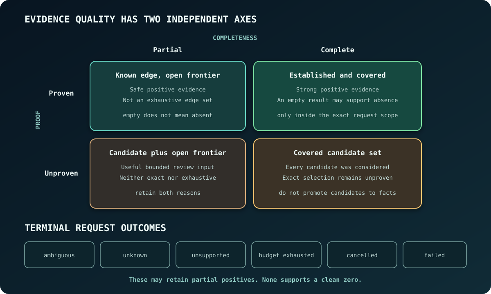

Bifrost results report both the evidence found and how much of the requested
search completed. A row can be useful positive evidence without proving that
the search was exhaustive. A completed search can return no rows and support a
bounded absence claim.

## Proof and completeness

Every semantic edge or relation carries two independent axes inside one public
`evidence` object. Optional `reason` carries the typed failure or limit that
explains an unproven or partial result:

| Field | Complete value | Limited value |
| --- | --- | --- |
| Proof | `proven` when retained evidence establishes the relation | `unproven` with a reason when the row is a structured candidate |
| Completeness | `complete` when evidence covers the requested semantics at that site | `partial` with a reason when a frontier remains |

Neither dimension implies the other. A proven edge can be one known edge in an
incomplete dispatch set. A complete candidate enumeration can contain an
unproven alternative when the available semantics cannot select one runtime
target.

When paths differ in proof or completeness, the solver keeps the incomparable
alternatives. It discards a path only when another path dominates its evidence.

Public renderers name the axes as `proof` and `completeness`; they do not mint a
third composite quality label. Cached policy unit rows retain the same evidence
object as direct, CLI, MCP, and LSP query results.

## Request outcomes

At the provider boundary, outcomes remain typed:

| Outcome | Meaning | May contain useful data? | Supports a clean zero? |
| --- | --- | --- | --- |
| `complete` | The requested supported work completed under its stated scope | Yes | Yes, inside that exact scope |
| `ambiguous` | More than one structured candidate remains | Yes | No |
| `unknown` | The provider cannot establish the requested relation | Sometimes | No |
| `unsupported` | The selected capability is unavailable for this input | Sometimes | No |
| `unproven` | A structured result exists without sufficient proof | Yes | No |
| `exceeded_budget` | A named work limit stopped the request | Sometimes | No |
| `cancelled` | Cooperative cancellation stopped the request | Sometimes | No |

Policy and extension surfaces may use wire labels such as `frontier_bounded`,
`budget_bounded`, `inconclusive`, or `refused`. Those labels preserve the same
semantic distinctions. A transport error remains distinct from an analysis
outcome.

Public semantic budget failures name a coarse lane: `source`, `rows`,
`retained_bytes`, `steps`, or `files`. The internal ledger can refine its
accounting without changing this vocabulary. In dispatch outcome rows,
`exceeded_limit` is optional: an unavailable lane does not turn budget exhaustion
into a complete result. Lane projection preserves the typed outcome, candidate
coverage, proof, and completeness.

## Scope is part of the claim

Completeness is scoped to the request that produced the result. Relevant scope
includes:

- workspace root and generation;
- selected languages, files, and path filters;
- operation and relation kinds;
- call depth and semantic frontier;
- active semantic-model set and dependency fingerprint;
- result, graph, source-byte, and traversal limits; and
- witness and provenance retention limits.

For example, a complete three-file search supports a three-file absence claim.
A procedure-local CFG query supports only that procedure-local claim.

Completeness also follows the fields a consumer uses. An exact call binding
establishes which actual argument maps to which formal parameter; it need not
establish the conversion between their types. Binding rows report conversion
proof separately as `proven`, `unknown`, or `not_applicable`, with a typed reason
when unknown. A conversion-dependent field read preserves that unknown through
cached rows and relational evaluation. It cannot become an ordinary null that
proves absence. A selector that uses only the exact binding identity does not
inherit unrelated conversion uncertainty.

Rust call conversions use exact annotated types and selected bindings to prove
identity and supported builtin reference adjustments: dereferencing,
mutable-to-shared reborrowing, and array-reference-to-slice unsizing. These
adjustments retain operation provenance without asserting an identity-breaking
value conversion. Their proof concerns conversion typing, not borrow validity;
unresolved lifetime, generic, or user-defined coercion obligations stay unknown.

The same separation applies to Java flow: an exact argument mapping establishes
value dependence even when the conversion annotation is unknown. That does not
establish reference identity. Unknown conversions cannot transport heap aliases,
and proven unboxing retains its possible exceptional boundary.

## Positive evidence and authoritative absence

A partial result supports only a narrow positive claim: Bifrost returned this
source-backed edge.

An empty result supports authoritative absence only when all relevant
conditions hold:

1. the request and transport succeeded;
2. the intended workspace generation was analyzed;
3. the capability was supported for every selected input;
4. execution completed without cancellation or a budget boundary;
5. every path selector the request named selected files that were searched;
6. result and provenance retention did not truncate the claim; and
7. the absence statement repeats the actual analysis scope.

Condition 5 is the selector half of the same rule. A path selector names a
file, a directory (with or without a trailing separator, selecting every file
beneath it), or a glob. A selector that names none of those searched nothing,
so the request covered less of the workspace than it asked for. Bifrost reports
that selector as written, marks the result incomplete, and reports absence as
unverified rather than proven.

## Provenance and source mapping

Stable identities support comparison, caching, and remapping of a semantic
subject. Source mappings let a person or client inspect why the subject or
relation was returned. Declaration identity remains independent of source
ranges.

Derived results can have several provenance paths. A bounded response may retain
only some of them, with omission status distinguishing one witness from an
exhaustive witness set.

### Effective configuration

Authored configuration facts and effective configuration are separate result
types. An authored fact says what one exact document snapshot contains. An
effective result says what wins after a caller supplies explicit layers,
profiles, includes, deployment overrides, placeholder expansions, or external
environment evidence together with their precedence relations.

The resolver never reads ambient process state, retrieves secrets, evaluates
expressions, or guesses framework bindings. Each contribution retains a stable
source identity and provider/version identity. Each precedence edge names the
lower and higher layer and the reason for that ordering. Structural keys omit
source ranges so the same key can correlate across files; the authored facts
retain the exact ranges as evidence.

Resolution is iterative and bounded by contribution and precedence-work limits.
A uniquely maximal contribution can provide useful positive evidence while a
missing include, unavailable environment, unknown profile, unresolved
interpolation, parser limitation, or other typed reason makes completeness
partial. Incomparable maximal contributions are a conflict even when their
opaque values have the same spelling: equality does not prove which source won.
Cancellation and either exhausted budget produce an unresolved proof rather
than fabricating a winner. Only a uniquely selected contribution with complete
evidence is an effective value claim.

A retained report identifies its artifacts, declarations, events, policies,
and sources before mapping them into the current presentation.

## Canonicalization across clients

Canonicalization happens before protocol-specific rendering. Equivalent LSP,
MCP, CLI, and library operations are expected to preserve result ordering,
identity, completion, diagnostics, and evidence. Adapters can map transport
errors or envelope fields. Canonical analysis execution and result
interpretation remain fixed.

Differential tests can compare that canonical payload across adapters
independently of transport timing and queue metadata.

## Cache consequence

Only complete, current artifacts are eligible for complete-value caches.
Cancelled, stale, budget-exhausted, store-failed, or semantically partial work
remains scoped to the request that produced it.

The storage chapter specifies the corresponding
[complete-value cache mechanics](../storage-and-cache/#complete-bounded-derived-values).

Operational wording is in [Agent Result Safety](/agent-result-safety/). The
identities and artifacts needed to replay a result are in
[Reproduce an Analysis](/reproduce-analysis/).
