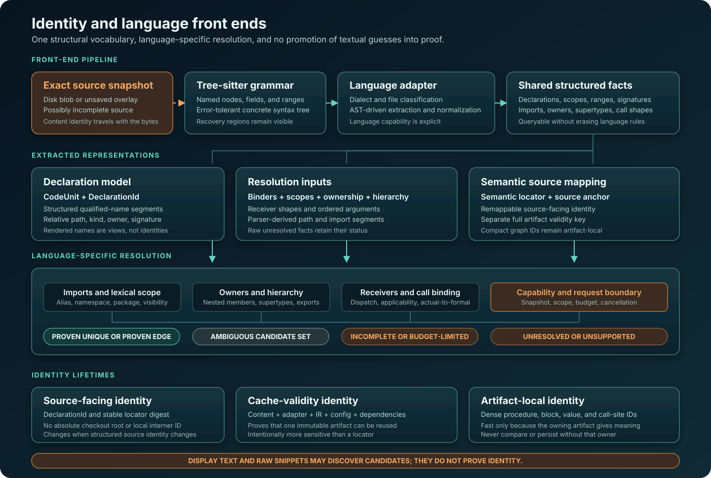

Bifrost uses one analysis vocabulary across languages, while each front end
retains its own rules for names, calls, and types. Tree-sitter provides the
common syntax foundation; language front ends translate that syntax into shared
structural records.

Structured identity connects the shared syntax model to language-specific
resolution. Exact analysis follows declarations, import binders, ownership, and
resolver evidence. Human-readable names and source snippets support presentation
and candidate discovery. Structured resolution supplies proof of which
declaration a program uses.

## Shared syntax, language-specific semantics

Tree-sitter gives each front end an incremental, error-tolerant concrete syntax
tree with named fields and byte ranges. These properties suit interactive
source: the file may be unsaved, mid-edit, generated in an unfamiliar style, or
valid only under a particular dialect. Bifrost can extract the structure that
remains even when a compiler invocation would fail.

The parser API supplies common tree access. A language adapter retains semantic
ownership: it selects the grammar and dialect, recognizes source files, reads
AST fields, extracts declarations and structured imports, normalizes source
coordinates, and reports parser recovery. Language modules add the rules that
differ: namespaces and packages, visibility, receiver lookup, inheritance,
overload applicability, export and re-export behavior, macro-derived shapes,
and dynamic dispatch boundaries.

Related languages can share a module where their semantics overlap. Current
front ends include families for C and C++, C#, Go, JavaScript and TypeScript,
JVM languages, PHP, Python, Ruby, and Rust. Shared result types let the rest of
the system ask comparable questions. Capability reporting distinguishes an
unsupported relation from an empty one.

## Front-end pipeline

A source file moves through a series of explicit contracts:

1. **Select language and dialect.** File classification chooses the adapter and
   parser configuration. Dialects such as C versus C++, or TypeScript versus
   TSX, remain visible to storage and semantic validity keys.
2. **Parse the exact bytes.** Disk content or an editor overlay is paired with
   its content identity and parsed under a cancellation budget.
3. **Extract structured facts.** The adapter walks tree nodes and fields to
   produce declarations, imports, containment, source ranges, raw hierarchy
   inputs, signatures, and other supported relations.
4. **Assign source identities.** Declarations receive structured names and
   stable source-facing identities; coordinates refer back to the exact file
   snapshot.
5. **Resolve with language rules.** Imports, lexical scopes, owner chains,
   hierarchy, receiver evidence, and callable applicability narrow candidates.
6. **Report an outcome.** A result carries the selected identities, supporting
   evidence, and whether the relevant search was exhaustive, ambiguous,
   incomplete, unsupported, stopped at a budget limit, or cancelled.

The persistent store records extracted relational facts. The parser's in-memory
object graph ends at the front-end boundary. Higher semantic representations
are built as immutable artifacts under their own complete validity keys. See
[Storage and Cache Strategy](../storage-and-cache/) for that lifetime split.

## Shared declaration model

The cross-language unit of declared structure is a `CodeUnit`. Its broad kind
can be a class-like declaration, function, field, module, macro, or file scope.
It also carries:

- the normalized workspace-relative source file;
- a structured fully qualified name whose segments retain their roles;
- the boundary between package or namespace and nested ownership;
- an optional signature when the language needs it to distinguish declarations;
- source ranges and containment relationships; and
- whether the declaration is source-written or synthesized.

`CodeUnit` captures distinctions used across queries while leaving specialized
facts in language or semantic layers. A Java overload signature, Rust module
path, C++ qualified owner, and Python nested function share the identity
machinery. Their language-specific resolvers still decide what each name means.

Rendered qualified names serve people and protocols. Resolvers use the
underlying package, type, member, local, and other segments. Reconstructing those
segments from display text discards structure that the front end already knows.

### Module and package source anchors

A source-declared module uses its declaration item as its primary range.
Rust's `pub mod m;` anchors in the declaring file, whether its contents live in
`m.rs` or `m/mod.rs`; its signature is the declaration's source text. Inline
Rust modules keep the range of their `mod m { ... }` item. Java packages likewise
retain their `package` declaration ranges. Navigation selects the name token
inside that item, as it does for other source declarations.

A file-backed module with no declaration token, such as a Python package's
`__init__.py`, navigates to the start of its backing file. A same-named class or
reference inside that file is not a declaration of the module. Go records
package membership and package-owned declarations rather than manufacturing a
single package declaration spanning all its files.

Rust crate roots reached through Cargo have a file-scope unit covering the root
source file, starting at byte zero (line 1, column 1 for clients). In the absence
of a `mod` item, Bifrost does not invent a module declaration or a `mod` signature
for that directory. A namespace-only lookup can therefore report no single
indexed declaration. The file-scope anchor remains available without choosing
an unrelated declaration as the crate's definition.

## Identity vocabulary

Different representations have different identity lifetimes. Treating all of
them as a "symbol ID" risks reuse outside the boundary where an ID is valid.

| Identity | What it contains | Valid use | Important limit |
| --- | --- | --- | --- |
| `DeclarationId` | A versioned digest of language, normalized relative path, declaration kind, structured qualified-name segments, package boundary, signature, and synthetic status | Referring to the same extracted declaration across processes that implement the same identity recipe | A move, rename, signature change, or identity-version change can produce a new ID |
| Semantic locator | Logical workspace mount, relative path, language, lexical declaration segments, semantic role, and source anchor | Finding or remapping source-facing semantic entities and explaining their origin | Requires a separate cache-validity key |
| Stable locator digest | The stable source-facing portion of a semantic locator, excluding the absolute checkout mount | Comparing equivalent source identities across checkout locations | Artifact inputs and dependencies still need independent validation |
| Semantic artifact key | The source revision or overlay content, logical mount and relative path, language, adapter and IR versions, configuration, and dependency fingerprints | Reusing one exact immutable semantic artifact | It contains more validity inputs than a locator |
| Dense procedure, block, value, or call-site ID | A compact index owned by one immutable artifact or graph | Fast graph construction and analysis within that owner | It has no meaning without the exact artifact or graph that owns it |
| Display name and source range | Human-readable rendering and coordinates | Diagnostics, navigation, and candidate discovery | Neither is exact declaration identity |

`DeclarationId` excludes an absolute checkout root and process-local interner
numbers, so byte-equivalent checkouts with the same relative structure can
produce the same ID. Moves, renames, signature changes, and identity-recipe
changes can still mint a different ID. A semantic locator provides a remappable
source-facing address. Artifact reuse is governed by the larger cache key.

Dense IDs are artifact-local and interpreted with the immutable artifact or
graph that assigned them. A bare value ID in storage, or a call-site comparison
across artifacts, has lost that required owner.

## Structured resolution

Resolution applies language-defined transformations to structured facts.
Candidate selection follows resolver evidence; unresolved ties remain
ambiguous.

### Imports, packages, and lexical ownership

Import extraction preserves parser-derived path segments, import kind, lexical
scope, aliases or binders, and declaration position. A resolver can therefore
distinguish a namespace import from a static member import, or a local alias
from a declaration that merely has the same spelling.

Language rules decide which prefixes are absolute, package-relative,
module-relative, nested-owner, exported, or otherwise visible. The shared
layer carries the paths and candidate identities; the language front end owns
the interpretation. Parsing import text with delimiters would lose exactly the
grammar distinctions the resolver needs.

### Python import roots

Python module identities start at a supported packaging import root when one
contains the source file. Bifrost searches ancestor directories, preferring the
nearest project and the deepest containing root. It reads
`tool.setuptools.packages.find.where` from `pyproject.toml` (#1971).

Legacy `setup.py` files can also establish a root (#3075). Bifrost parses the
Python syntax without executing the script and recognizes a direct call to an
imported setuptools or distutils `setup` function with a `packages` argument:
a literal `package_dir` mapping (`{}` or `{"": "source"}`) establishes the root
regardless of the packages expression and takes precedence over discovery.
Without `package_dir`, a nonempty literal package collection uses the script
directory, while calls to imported setuptools `find_packages` or
`find_namespace_packages` (including aliases) use their literal `where` argument
or the script directory when omitted; dynamic roots and argument expansions do
not establish a root. The selected directory is the import root even if it
contains `__init__.py`. For example, Wirecloud's
`src/setup.py` declares `packages=('wirecloud',)`, so
`src/wirecloud/commons/utils/testcases.py` has module identity
`wirecloud.commons.utils.testcases`.

A filename such as `src`, an empty `__init__.py`, or the presence of `manage.py`
alone does not establish a root. Unsupported dynamic packaging arguments do not
supply a default root. Without supported packaging evidence, the existing
outermost `__init__.py` package convention remains in effect; namespace paths
without such a package retain their workspace-relative components. Import
resolution and workspace-boundary checks use these same indexed identities.
They do not search for matching suffixes or add alternate module names.

### Hierarchy and members

Adapters extract declared supertypes and owner relationships from AST fields.
Language-specific hierarchy resolution then connects those references to
declaration identities under the relevant package, import, generic, and
visibility rules. Member search follows resolved owners and hierarchy evidence.
Equal short display names leave type identity unresolved.

An unresolved supertype remains an unresolved edge. The raw structured
reference stays available for later resolution and retains its unresolved
status until new evidence proves the relationship.

### Calls, receivers, and argument binding

Call extraction records a typed call kind, receiver shape, ordered argument
groups, and whether that shape was extracted completely. Resolver evidence
narrows possible callees using the language's dispatch and applicability rules.
Actual-to-formal binding requires structured rows joined to stable call and
declaration identities.

The result can distinguish:

- one applicable target with exact binding;
- multiple applicable targets that remain ambiguous;
- a useful candidate set from partial receiver or argument evidence;
- an unresolved name after an exhaustive supported search;
- a dynamic or macro-derived call whose shape is unknown; and
- a language feature for which the front end has no supported resolver.

The binder accepts the resolver's selection. If several overloads survive,
binding remains ambiguous.

## Partial source and parser recovery

Interactive source is often temporarily invalid. Tree-sitter can recover a
tree containing `ERROR` or missing nodes, and Bifrost retains those recovery
regions. Structure outside them can remain useful: a declaration that parsed
cleanly may still be navigable even when a neighboring expression is
unfinished.

Parser and semantic status are tracked separately:

- **parse job complete** means extraction finished for the exact input bytes and
  the resulting fact set can be published atomically;
- **syntax clean** means no relevant parser recovery was required; and
- **semantic analysis complete** means the requested capability covered its
  declared scope without encountering an unsupported construct, cancellation,
  or exhausted budget.

A fact set for a file with parser errors can still be published once extraction
finishes for the exact bytes. Publication says that extraction completed; the
syntax and semantic-recovery statuses remain separate. A query whose proof
crosses a damaged region retains that limitation.

Parser timeout or cancellation leaves the extraction job unfinished, so
publication is refused under the shared
[complete-value cache contract](../storage-and-cache/#complete-bounded-derived-values).

## Proof, ambiguity, and completeness

Bifrost treats candidate discovery and proof as separate stages. A structural
match can remain useful when the resolver cannot prove a unique binding. The
result identifies which kind of evidence it contains.

The exact outcome vocabulary varies by capability. These distinctions stay
stable:

- **proven** means the language resolver supplied the required relationship;
- **ambiguous** means structured evidence supports more than one surviving
  identity;
- **incomplete** means some relevant search space was not examined or could not
  be constructed;
- **unsupported** means the requested relationship is outside the front end's
  declared capability; and
- **budget exhausted or cancelled** means the request stopped before reaching
  its normal semantic boundary.

Proof and completeness are independent. One proven edge can be returned from a
partial search; the response cannot claim that no other edge exists. An
empty result is authoritative only when the applicable resolver completed an
exhaustive supported search in the stated snapshot and scope. The
[Evidence and Result Contract](../evidence-and-results/) develops this rule at
the API boundary.

## Exact-claim discipline

Several guardrails follow from the identity model:

- use AST fields, structured name segments, import binders, declaration IDs,
  semantic locators, and resolver evidence for exact claims;
- use source text or textual search for candidate discovery; proof requires
  structured resolver evidence;
- do not recover a structured path by splitting its rendered display name;
- do not select one declaration only because it is the first or nearest item
  with the requested short name;
- retain all supported candidates when evidence is ambiguous; and
- return typed incomplete or unsupported outcomes when the front end lacks the
  structure needed to decide.

Protocol strings are presentation data. Exact results still carry the identity
and provenance behind them.

## Adding or extending a language front end

A front-end contract covers grammar registration and the following boundaries:

1. file and dialect classification;
2. declaration, qualified-name, signature, and containment extraction;
3. structured import and scope representation;
4. hierarchy, receiver, callable, and reference capabilities;
5. source recovery, generated-code, and macro behavior;
6. identity and semantic-version inputs used by persistent and in-memory
   artifacts; and
7. the outcome returned for constructs it cannot resolve exactly.

Tests should pair realistic positive cases with near misses: same short name in
another owner, shadowed binders, ambiguous overloads, unresolved imports,
partial source, and unsupported dynamic shapes. The common contract requires
truthful coverage: every supported result says what evidence established it,
and every gap remains visible.

## Coverage by capability

A language can support syntax search before it supports exact calls or dataflow.
Each exact capability ships with its corresponding identity and resolver
contracts. Coverage still differs by language adapter.
