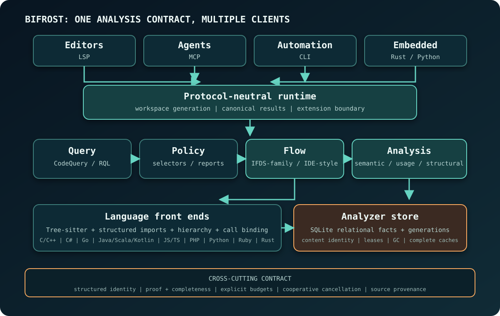

Bifrost provides interactive program analysis to editors, coding agents,
automation, and embedded tools. Every result records its source evidence, proof
status, analysis scope, and completeness. A missing result supports an absence
claim only when the relevant analysis completed inside a stated boundary.

The design chapters describe how Bifrost is built and where its current
contracts end. Entries marked `Direction` or `Research` identify unshipped
work. The linked product docs cover API details.

## Contents

| Chapter | Central question |
| --- | --- |
| [System Architecture](./system-architecture/) | How do clients, runtimes, analyzers, and stores fit together? |
| [Identity and Language Front Ends](./identity-and-language-frontends/) | How does Bifrost turn incomplete multi-language source into resolvable identities? |
| [Storage and Cache Strategy](./storage-and-cache/) | What is persisted, reused, invalidated, and recomputed? |
| [Usage Analysis Engine](./usage-analysis/) | How are definitions, references, calls, and receiver-sensitive candidates connected? |
| [Dataflow Engine](./dataflow-engine/) | How do the bounded IFDS-family and IDE-style kernels power value flow, taint, and typestate? |
| [Semantic Models and Summaries](./semantic-models/) | How does external behavior participate while retaining its own provenance? |
| [Evidence and Result Contract](./evidence-and-results/) | When may a client claim that something is present, absent, or unresolved? |
| [Decisions and Outlook](./decisions-and-outlook/) | Which choices are settled, which are current directions, and what remains open? |
| [Related Work](./related-work/) | Which adjacent systems influenced the design, and where is Bifrost's emphasis different? |

## Representation lifetimes

Source-derived structural facts are durable. Semantic artifacts and graph
projections are validity-keyed, and interprocedural analysis materializes only
the region a request needs. Protocol adapters reuse the runtime's analysis
semantics.

See [Representation lifetimes](./system-architecture/#representation-lifetimes)
for the full table and
[Analysis storage layers](./storage-and-cache/#analysis-storage-layers) for the
persistence and reuse rules.

## Status vocabulary

Status labels distinguish shipped behavior from planned and open work:

- **Current** describes behavior present in the repository version documented
  by this site.
- **Direction** describes an intended design still under implementation.
- **Research** describes a question whose contract or engineering trade-off is
  still being evaluated.

The [Decisions and Outlook](./decisions-and-outlook/) chapter collects all
Direction and Research entries. Each states its readiness conditions; roadmap
labels carry no release dates.

## Other documentation

For user-visible behavior, start with [Capabilities](/capabilities/) and
[Code Querying](/code-querying/). Use [Agent Result Safety](/agent-result-safety/)
to interpret a particular response, and
[Evidence and Evaluation Methodology](/evaluation-evidence/) to see what
public tests and benchmarks establish.
