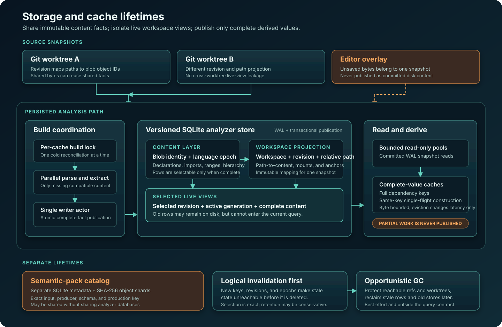

Bifrost reuses a stored answer only while its source, language semantics, and
configuration still match the request. Durable facts, workspace membership,
derived in-memory values, and generated semantic-model objects use different
identity and retention rules.

## Design goals

Storage must support reuse across processes and compatible Git worktrees while
keeping stale or incomplete state out of current answers. Indexed relational
queries avoid reopening every file, and explicit budgets constrain memory and
concurrent work under interactive workloads.

The design separates *identity*, *liveness*, and *retention*. A row can remain
on disk after the live workspace stops selecting it. An evicted derived value
can be rebuilt from its durable inputs. Garbage collection may lag invalidation
while selection rules keep the old state out of current answers.

## Analysis storage layers

| Layer | Identity | Lifetime | Role |
| --- | --- | --- | --- |
| Content facts | Content or Git blob identity, language storage key, and analysis generation | Across revisions, processes, and compatible worktrees | Queryable declarations, ranges, imports, hierarchy inputs, and other source-derived facts |
| Workspace projection | Bound workspace, revision, relative path, and selected language generation | One immutable view of a workspace | Maps live paths to content and prevents facts from another revision or worktree leaking into a request |
| Derived values | Full dependency key for the value being computed | Memory-resident while useful and within a byte budget | Semantic artifacts, graph projections, evidence indexes, and similar immutable products |

### Content-addressed relational facts

The persistent analyzer store is SQLite. Its rows are normalized, queryable
relations: declarations and their structured names, source ranges, signatures,
imports, containment, supertypes, and other inputs used by higher layers.

For Git-tracked source, the blob object ID supplies content identity. The same
bytes can reuse parsed facts at another path, revision, or linked worktree.
Language and dialect also enter that identity: TypeScript and TSX, or C and C++,
can produce different facts from byte-identical input.

A parse or extraction job prepares its complete fact set, then publishes that
set with a completion marker in one transaction. Cancellation, timeout, parser
failure, and interrupted writers leave an unusable candidate. Readers select
only committed facts marked complete in the active analysis generation.

### Revisioned workspace projections

The store also needs a path mapping for the files in a workspace. An immutable
workspace revision maps workspace-relative paths to content identities and
records workspace-specific structures such as package mounts and path-to-symbol
anchors.

Each read connection selects the revision it serves. Its live views join that
selection with the active per-language generation and complete content facts.
This projection is the main isolation boundary:

- an old row may remain physically present but is invisible to the live view;
- two worktrees can share blob facts while retaining different path mappings;
- a request observes one selected projection instead of a mixture of revisions;
  and
- replacing a path-to-content mapping does not require rewriting global facts
  for content that is still reusable elsewhere.

Unsaved buffers participate as snapshot-specific content. Their bytes enter the
request's content identity and remain separate from the committed disk version
at the same path.

### Complete, bounded derived values

Per-file semantic artifacts, usage-ranking graphs, structural indexes, resolver
evidence, and bounded graph projections are expensive or request-specific.
These immutable values live in byte- or weight-bounded in-memory caches.

Publication requires:

1. the key names every input that can change the value;
2. same-key work is single-flight, so concurrent requests share the same
   expensive construction;
3. only a validated complete value becomes ready for later callers; and
4. failure, cancellation, partial discovery, or budget exhaustion is returned
   to the requesting caller but is never published as a reusable complete
   value.

Eviction can require a later rebuild. The rebuilt value follows the same
publication contract, so its published meaning remains bound to its key.

## Versions, generations, revisions, and epochs

Several version-like values protect different boundaries:

| Mechanism | Changes when | Effect |
| --- | --- | --- |
| Store schema version | The relational layout or migration contract changes | Opens a compatible versioned store; older store files may coexist until cleanup |
| Language epoch | Grammar, extraction queries, or language-specific persisted semantics change | Rotates that language's active generation so incompatible rows become invisible |
| Workspace revision | The live path-to-content or workspace projection changes | Selects a new immutable live view without invalidating reusable content elsewhere |
| Content identity | File bytes or an unsaved overlay change | Invalidates products that depend on that content |
| Representation version | A derived artifact or graph encoding changes | Prevents an old in-memory representation from satisfying the new contract |

A language epoch is a stable fingerprint of the parser grammar, extraction
queries, and an explicit language-specific semantic salt. Rotation follows a
change to persisted meaning, even when the database columns are unchanged; a
release number by itself is not a rotation trigger.

Workspace content identity combines normalized relative paths and their content
identities, the relevant language epochs, analyzer configuration, and overlays.
Absolute checkout paths and process-local generation numbers are excluded.
Byte-equivalent checkouts can then match, and each language can rotate
independently. When Bifrost cannot establish the required identity, it rebuilds.

## Read and build concurrency

SQLite runs in write-ahead logging mode. A bounded pool of read-only
connections can serve committed snapshots while one writer connection publishes
new facts. Inside a process, a writer actor owns that connection and serializes
write jobs; SQLite supplies the corresponding cross-process arbitration.

The complete workspace build adds a per-cache build lock. Linked worktrees often
discover the same missing blobs at the same time; independent parsing and
publication of that identical set would waste CPU and increase writer
contention.
One elected build reconciles the shared store while the others wait and then
observe its committed work. The elected build may still parallelize parsing
internally before serialized publication.

A normal persisted-build lifecycle is:

1. compute the desired workspace revision and relevant language epochs;
2. acquire the build lock for the exact cache database;
3. recheck the store, because another process may have completed work while
   this process waited;
4. parse only missing or incompatible content;
5. publish each complete fact set through the writer;
6. commit the new workspace projection;
7. let reader connections select that immutable revision.

That serialization is scoped to store reconciliation. Ordinary queries run
independently of an unrelated analysis request, and readers continue seeing the
prior committed snapshot until the new revision becomes available.

## Cache-key discipline

Every reusable value has a dependency-complete key. Depending on its layer, that
key can include:

- workspace content identity and selected store generations;
- disk or overlay content identity;
- language, dialect, and adapter semantics version;
- analyzer and resolver configuration;
- semantic-model or dependency fingerprints;
- requested projection, filter, or scope; and
- the representation version of the cached value.

Include an input in the key whenever changing it can change the answer. Exact
content and normalized workspace coordinates usually supply the identity;
timestamps and absolute checkout paths add no discriminating information.
Omitting a semantic dependency risks serving one request's answer to another.

## Semantic-model objects

Generated semantic-model packs have their own sharing and validation rules. They
live in a separate versioned catalog with SQLite metadata and content-addressed
SHA-256 object shards. Production binds the exact input digest, producer
identity and version, semantic schema version, and catalog production version.

The separate catalog has its own lifecycle:

- analyzer databases remain scoped to a repository's source and workspace
  projections;
- an explicitly shared semantic-pack root can reuse an identical generated
  dependency pack across otherwise unrelated repositories;
- pack objects can be staged, validated, and atomically published without
  entering the analyzer writer pipeline; and
- catalog retention and provenance do not become analyzer-row liveness rules.

Activation remains snapshot-bound. Catalog membership establishes availability;
the workspace and request determine applicability. The modeling contract is
described in [Semantic Model Packs](/semantic-model-packs/) and
[Semantic Models and Summaries](../semantic-models/).

## Invalidation and garbage collection

New revisions, epochs, or validity keys immediately stop old state from
matching. Physical deletion follows later, keeping foreground edits independent
of a full database sweep.

Opportunistic garbage collection then reclaims unreachable analyzer rows, stale
language generations, and superseded versioned stores. Reachability is seeded
from repository references and active worktree state, including current working
files that no committed revision represents. Collection is best effort and
throttled. Failure to reclaim space must preserve every live fact set and leave
incomplete candidates unpublished.

## Current decisions and trade-offs

| Decision | Benefit | Cost |
| --- | --- | --- |
| Persist normalized facts in SQLite | Indexed, composable queries and transactional publication | Schema and migration discipline are required |
| Share content rows, isolate workspace projections | Cross-worktree reuse without cross-worktree path leakage | Every query must pass through the selected live view |
| Rotate per-language generations from semantic epochs | Immediate logical invalidation with isolated blast radius | Old rows need later physical reclamation |
| Use one writer and serialize whole-store reconciliation | Predictable publication and less duplicate build work | Simultaneous cold starts for one cache do not all build independently |
| Cache only complete immutable derived values | Reuse cannot promote partial work into certainty | Cancelled or bounded work may be recomputed |
| Separate semantic-pack objects from analyzer rows | Independent provenance, sharing, and retention boundaries | Operators must reason about two stores with distinct lifetimes |

## Direction: compositional resolution fragments

**Status: Direction.** Repeated name and member resolution could be
factored into small immutable fragments: a decoded import binding, one owner or
namespace hop, or a candidate set with its proof and completeness. A larger
resolution would compose those fragments and invalidate only the pieces whose
declared dependencies changed.

A persistent cross-request contract is still required. Fragment identities
must cover language semantics, scope, visibility, dependency graphs, ambiguity,
and negative-result completeness. An empty candidate set can be cached only when
its search is provably exhaustive. Bifrost recomputes at the coarser
complete-value boundaries above until those contracts exist.

[Immutable compositional usage facts](../usage-analysis/#persisted-inputs-and-compositional-usage-facts)
specifies workspace composition; its roadmap entry is
[Compose immutable usage facts](../decisions-and-outlook/#compose-immutable-usage-facts).

## Operational boundary

By default, the persistent cache follows the primary Git repository so linked
worktrees can share compatible content facts. Non-Git or ephemeral
analysis can use a temporary store. Cache-root overrides, filesystem
permissions, relocation, and deletion are operational contracts; see
[Data Boundaries and Local Analysis](/data-boundaries/) for user-facing details.
