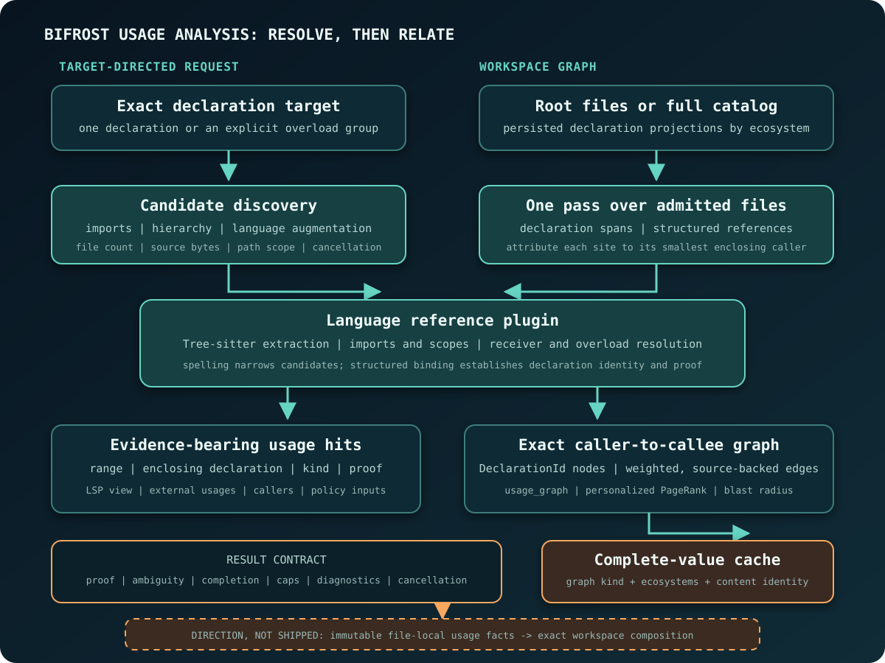

Usage analysis answers where a declaration is used. For each occurrence, it
binds the occurrence to a declaration using the language's resolution rules,
records the evidence for that binding, and reports the scope that the request
examined.

Bifrost uses those same rules for target-directed reference queries and bulk
caller-to-callee graphs. An interactive lookup narrows toward its target. A
bulk build processes admitted files and accumulates graph products.

## Reference queries and workspace graphs

| Workload | Starts from | Optimized for | Primary result |
| --- | --- | --- | --- |
| Target-directed references | One exact declaration or an explicit overload group | Editor references, agent navigation, callers, and focused policy work | Source hits grouped by target, with kind and proof |
| Workspace usage graph | Root files or the complete declaration catalog | Code maps, relevance ranking, blast radius, graph export, and bulk dead-code evidence | Exact declaration nodes and weighted caller-to-callee edges |

## Target-directed pipeline

### 1. Establish the target

The public selector resolves before the reference engine starts. The engine
receives either a declaration-backed `CodeUnit` or a group of
declarations that one source reference may legitimately name. Overloads and
duplicate declarations remain separate candidates. The engine scans every
candidate and unions proven hits by source site. At a site where candidates
disagree on proof, it retains the proven reading.

Name collisions are common in vendored trees, generated/source pairs, overload
sets, and multi-module workspaces. A reference stays visible when any candidate
in the target group can prove it.

### 2. Discover candidate files

Candidate discovery favors coverage because an omitted file can conceal a real
reference. The generic path follows structured import reachability, includes the
target's defining context, and expands type hierarchies where polymorphism
applies. A language plugin can add files required by its module, autoload,
re-export, include, or visibility rules.

The request then applies its path and test-file scope. Independent file-count
and source-byte limits control admission. When one limit forces truncation, core
candidates are protected before supplemental expansion. Cancellation is checked
throughout discovery and again during the file scan.

A budget is part of the request's semantics. If it suppresses any file planned
by discovery, the result is incomplete even when every admitted file was
resolved exactly.

### 3. Extract structured sites and resolve them

The registry selects one reference plugin for the target's language. That plugin
owns language-specific meaning: imports, local bindings, namespaces, receiver
types, inheritance, overload applicability, constructors, macros, and dynamic
forms. Shared orchestration owns traversal, budgets, cancellation, and the
common result contract.

Plugins begin with Tree-sitter structure and indexed declarations. Resolution
succeeds when the language resolver binds a structured reference candidate to a
declaration identity. A best-effort binding remains unproven, and an unsupported
operation or missing graph seed produces a typed diagnostic.

### 4. Publish hits with their roles

A usage hit carries its file, byte range, line, enclosing declaration,
reference classification, proof, and presentation snippet. It also carries a
semantic role: ordinary reference, import, re-export, self receiver,
declared-contract reference, definition, or override declaration.

Consumers select the roles appropriate to their surface. Editor
find-references includes binding and self-reference sites for navigation;
external usage, call-graph, and relevance surfaces omit them. Classification
happens once, so every surface uses the same resolution rules.

## Exact identity across languages

Workspace graph nodes are keyed by an exact `DeclarationId`, with the ecosystem
and file scope retained where needed to interpret it. A fully qualified name,
language label, path, signature, and range are descriptive fields on that node.

An ecosystem is the candidate universe in which a reference is resolved. Java,
Scala, and Kotlin share a JVM ecosystem because their declarations can meet on
one classpath. JavaScript and TypeScript share a module ecosystem. Each language
and declaration still has its own identity, and in module-scoped ecosystems the
defining file separates equal export names from unrelated files.

During a bulk scan, a resolver retains the exact target declaration beside the
source span before display-oriented aggregation. An edge is published after both
caller and callee hydrate to graph nodes. Fields, modules, and macros can appear
in focused reference analysis; the public workspace graph uses classes and
callables as its ranking nodes.

## Proof and completeness dimensions

Usage analysis applies the
[shared outcome vocabulary](../identity-and-language-frontends/#proof-ambiguity-and-completeness)
to five domain-specific dimensions:

| Dimension | Examples | What it means |
| --- | --- | --- |
| Target selection | success, ambiguous, failure | Whether the requested declaration or declaration group was established |
| Per-site proof | proven, unproven | Whether structured resolution established this particular edge |
| Request completion | complete, cancelled, candidate-file budget exhausted, source-byte budget exhausted | Whether the planned file scope was fully processed |
| Output bound | complete enumeration, too many call sites with a sample | Whether every admitted site could be returned |
| Bulk-graph coverage | complete, truncated inbound, unproven inbound, incomplete reason | Whether a node's incoming graph evidence is exhaustive and exact |

The
[Evidence and Result Contract](../evidence-and-results/#positive-evidence-and-authoritative-absence)
defines the general rule. For usage analysis, a complete file scan can contain
unproven sites, and one proven edge says nothing about unexamined inbound edges.

A call-site cap leaves the hot symbol in the bulk graph's node catalog and marks
omitted inbound edges as truncated. A client can then narrow the request and
retry.

## Workspace graph and relevance ranking

The bulk engine makes one pass over admitted files. For each file it creates a
declaration index, reads or parses prepared syntax, resolves structured
references, and records distinct sites by file, line, and enclosing caller.
Per-file products merge deterministically into weighted caller-to-callee edges.
Source trees can then be released after edge construction.

Bifrost has two ranking graph shapes:

- The coarse file graph uses structured direct file dependencies. It avoids
  exact receiver and overload resolution and is the lower-cost relevance path.
- The exact graph uses declaration nodes and resolved reference-kind weights.
  It supports a more precise but more expensive ranking and the public usage
  graph surface.

Personalized weighted PageRank propagates mass from the requested seed files
through the selected graph. Reference kinds can carry different calibrated
weights, and node scores are aggregated back to files. The score expresses
relevance over analyzer evidence, without modeling execution order or general
semantic importance.

### Complete-value graph cache

Workspace ranking graphs are snapshot-owned derived values. Their keys include
the representation version, graph kind, selected language ecosystems, and
content identity for exactly those ecosystems. An unrelated ecosystem edit
leaves the key valid; an in-scope edit changes it.

The graph follows the shared
[complete-value cache contract](../storage-and-cache/#complete-bounded-derived-values):
same-key work is single-flight, only complete values publish, and an oversized
complete graph may be returned without retention. Its graph-specific guard
rechecks content identity at publication. An update racing the build then leaves
the completed graph unpublished.

## Persisted inputs and compositional usage facts

> **Current:** Bifrost persists declaration and identifier projections, owns
> language-specific indexes and prepared facts, builds target-directed or bulk
> usage products on demand, and retains only complete workspace ranking graphs
> under exact content keys.

Each language currently assembles workspace graphs by revisiting its resolution
process. Some analyzers cache or persist file-derived inputs, and the declaration
catalog reads persisted summary projections. A uniform production boundary
remains proposed work.

> **Direction:** make immutable file-local usage facts the common
> production boundary, then compose workspace graphs from those facts plus the
> exact workspace manifest and resolver dependencies.

The [Decisions and Outlook](../decisions-and-outlook/#compose-immutable-usage-facts)
entry is the roadmap-level summary. The related
[compositional resolution fragments](../storage-and-cache/#direction-compositional-resolution-fragments)
section covers the finer-grained cache question behind that direction.

The proposal requires:

1. A source blob and extraction-semantics version identify an immutable local
   fact set: structured occurrences, enclosing declarations, imports, and
   language-owned binding inputs.
2. A workspace composer resolves cross-file identities against the current
   manifest, dependency fingerprints, configuration, and ecosystem rules.
3. An edit replaces facts only for changed content, then recomposes the
   affected dependency frontier.
4. Proof, ambiguity, omitted scope, and provenance remain fields of the
   composition. Cached facts retain their original proof and completeness.

Safe composition depends on complete dependency identity. Import aliases,
conditional includes, macro environments, inheritance, package graphs, and
dynamic receiver evidence can all affect what a fact means. A compositional
design must identify each dependency precisely and decline reuse when it cannot.
Current resolvers remain authoritative until that contract exists for every
language plugin.

## Boundaries and evaluation

The documented scope excludes compiler-complete dynamic dispatch, runtime call
frequency, whole-program points-to, and complete external-library indexing.
Language-specific unsupported forms, open dispatch, budget exhaustion, and
unresolved receiver evidence remain visible in the result.

For user-facing coverage, see [Language and Analysis Capabilities](/capabilities/).
For safe interpretation of zero or partial results, see
[Agent Result Safety](/agent-result-safety/).

[UsageBench](https://usagebench.brokk.ai/) provides versioned,
analyzer-neutral evaluation of symbol usage and reverse navigation. Its
published and development populations remain separate. The
[Evidence and Evaluation Methodology](/evaluation-evidence/) page defines the
claims that those results can support.
